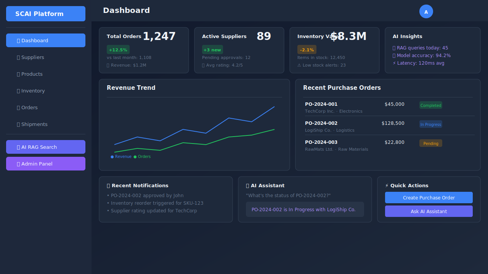
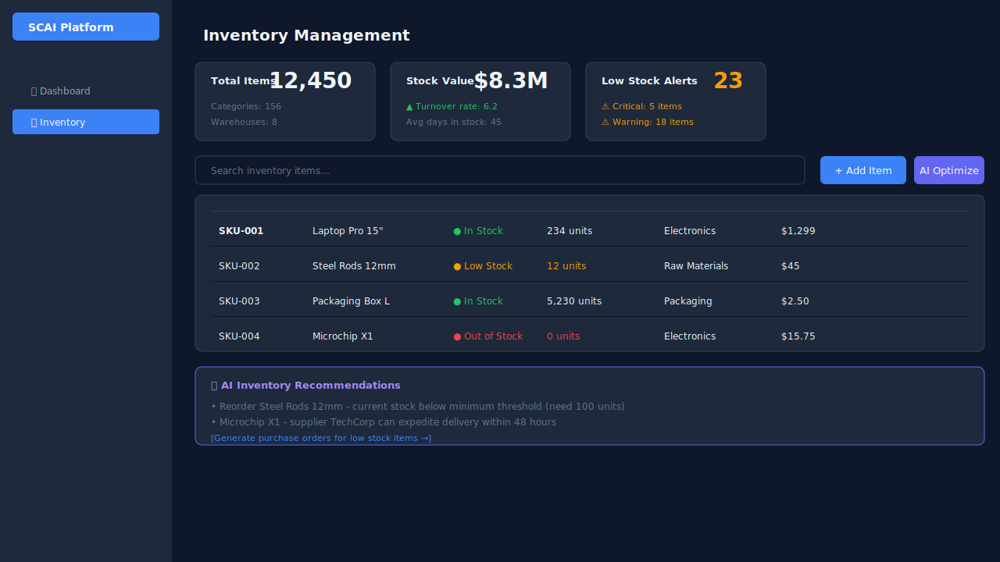
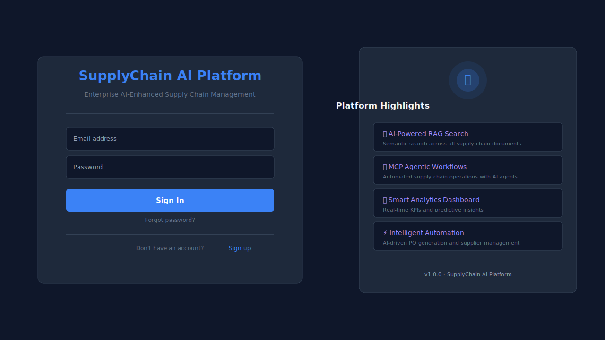
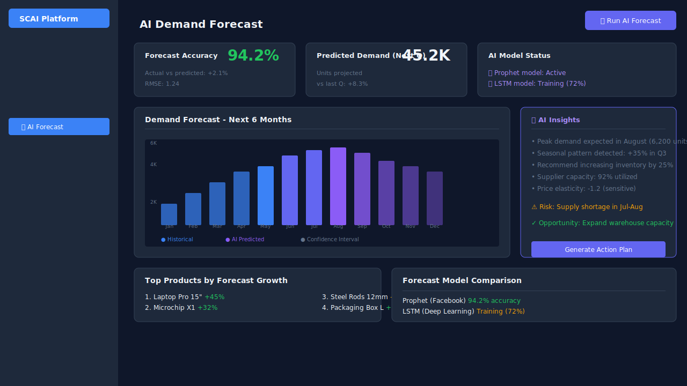

# SupplyChain AI Platform

> **Enterprise-Grade AI-Enhanced Supply Chain Management System** — A production-ready microservices platform built with Spring Boot 3.3, Spring Cloud 2023, and Angular 18, featuring advanced RAG, MCP, and agentic AI capabilities with 34 microservices and 40+ Docker containers.

[](https://adoptium.net/)
[](https://spring.io/projects/spring-boot)
[](https://angular.dev/)
[](https://www.postgresql.org/)
[](https://kafka.apache.org/)
[](https://redis.io/)
[](https://www.docker.com/)
[](https://docs.langchain4j.dev/)
[](https://docs.spring.io/spring-ai/reference/)
[](https://en.wikipedia.org/wiki/Microservices)

---

## 📸 Screenshots

| Dashboard | Suppliers |
|:----------|:--------:|
|  |  |

| Inventory | Shipments & Tracking |
|:----------|:--------:|
|  |  |

| Login |
|:----------:|
|  |

| AI Demand Forecast |
|:----------:|
|  |

| AI RAG Search | Admin Dashboard |
|:----------:|:--------:|
|  |  |

---

## 📋 Table of Contents

- [System Design Overview](#-system-design-overview)
- [High-Level Design (HLD)](#-high-level-design-hld)
- [Low-Level Design (LLD)](#-low-level-design-lld)
- [RAG System Design](#-rag-system-design)
- [Application System Design (Before AI)](#-application-system-design-before-ai)
- [Architecture Overview](#-architecture-overview)
- [Project Structure](#-project-structure)
- [Service Map & Ports](#-service-map--ports)
- [Tech Stack](#-tech-stack)
- [AI/RAG Capabilities](#-airag-capabilities)
- [Data Flow & Workflows](#-data-flow--workflows)
- [API Documentation](#-api-documentation)
- [Security](#-security)
- [Monitoring & Observability](#-monitoring--observability)
- [Testing](#-testing)
- [Getting Started](#-getting-started)
- [Deployment](#-deployment)
- [Contributing](#-contributing)

---

## 🏗 System Design Overview

### Platform at a Glance

| Metric | Value |
|--------|-------|
| **Microservices** | 34 (31 domain + 3 AI) |
| **Docker Containers** | 40+ |
| **Database Schemas** | 16 PostgreSQL + 8 MongoDB |
| **API Endpoints** | 200+ RESTful APIs |
| **Message Topics** | 25+ Kafka topics |
| **Frontend Modules** | 20+ Angular feature modules |
| **AI Models** | 3 (llama3.1, nomic-embed-text, + custom) |
| **Vector Dimensions** | 768 (PGVector HNSW index) |
| **Architecture Style** | Event-Driven Microservices |

### Design Philosophy

```
┌─────────────────────────────────────────────────────────────────────────────┐
│                     DESIGN PRINCIPLES                                        │
├─────────────────────────────────────────────────────────────────────────────┤
│                                                                             │
│  1.  Domain-Driven Design  ─── Each microservice owns its domain             │
│  2.  Schema-per-Service    ─── Database isolation per service                │
│  3.  Event-Driven          ─── Async communication via Kafka                 │
│  4.  AI-First              ─── RAG & LLM integrated at every layer           │
│  5.  Resilience            ─── Circuit breakers, retries, timeouts           │
│  6.  Observability         ─── Metrics, tracing, logging everywhere          │
│  7.  Security by Design    ─── JWT, RBAC, rate limiting, encryption          │
│                                                                             │
└─────────────────────────────────────────────────────────────────────────────┘
```

---

## 🏛 High-Level Design (HLD)

### 1. System Architecture Diagram

```
┌─────────────────────────────────────────────────────────────────────────────────────────────┐
│                                     CLIENT LAYER                                            │
│  ┌───────────────────────────────────────────────────────────────────────────────────────┐   │
│  │                              Angular 18 SPA (Single Page Application)                  │   │
│  │  ┌─────────┐ ┌──────────┐ ┌─────────┐ ┌──────────┐ ┌────────┐ ┌────────┐ ┌─────────┐  │   │
│  │  │ Auth    │ │ Dashboard│ │Supplier │ │Inventory │ │ Orders │ │ AI Chat│ │ Admin   │  │   │
│  │  │ Module  │ │ Module   │ │ Module  │ │ Module   │ │ Module │ │ Module │ │ Module  │  │   │
│  │  └────┬────┘ └────┬─────┘ └────┬────┘ └────┬─────┘ └───┬────┘ └───┬────┘ └────┬─────┘  │   │
│  └───────┼───────────┼────────────┼───────────┼───────────┼──────────┼───────────┼────────┘   │
│          │           │            │           │           │          │           │            │
│          └───────────┴────────────┴───────────┴───────────┴──────────┴───────────┴──────────┘    │
│                                          │ HTTP/HTTPS                                           │
└──────────────────────────────────────────┼─────────────────────────────────────────────────────┘
                                           ▼
┌─────────────────────────────────────────────────────────────────────────────────────────────┐
│                                     API GATEWAY LAYER                                        │
│  ┌───────────────────────────────────────────────────────────────────────────────────────┐   │
│  │                         Spring Cloud Gateway (Port 8080)                                │   │
│  │  ┌──────────────┐ ┌──────────────┐ ┌──────────────┐ ┌──────────────┐ ┌──────────────┐  │   │
│  │  │ JWT Validation│ │ Rate Limiting│ │ Route Locator│ │ AI Proxy     │ │ CORS/Security│  │   │
│  │  │ Filter       │ │ (100 req/min)│ │ (34 services)│ │ (RAG/MCP)    │ │ Headers      │  │   │
│  │  └──────────────┘ └──────────────┘ └──────────────┘ └──────────────┘ └──────────────┘  │   │
│  └───────────────────────────────────────────────────────────────────────────────────────┘   │
└──────────┬─────────────────────────────────────┬───────────────────────────────────────────┘
           │                                     │
           ▼                                     ▼
┌──────────────────────────┐     ┌──────────────────────────────┐     ┌──────────────────────┐
│   SERVICE REGISTRY       │◄───►│      CONFIG SERVER           │     │   OLLAMA LLM         │
│   (Eureka - Port 8761)   │     │  (Spring Cloud - Port 8888)  │     │   (GPU/NVIDIA)       │
│   Health monitoring      │     │  Externalized config          │     │   Port 11434          │
│   Service discovery      │     │  Git-backed repository        │     │   Models: llama3.1   │
└──────────────────────────┘     └──────────────────────────────┘     └──────────────────────┘
           │
           ▼
┌─────────────────────────────────────────────────────────────────────────────────────────────┐
│                                   MICROSERVICES LAYER (34 Services)                          │
│                                                                                             │
│  ┌───────────────────────────────────────────────────────────────────────────────────────┐  │
│  │  DOMAIN CLUSTERS (6 Domains × 4-6 Services Each)                                      │  │
│  │                                                                                       │  │
│  │  ┌──────────────────┐ ┌─────────────────────┐ ┌──────────────────────┐               │  │
│  │  │  INFRASTRUCTURE  │ │   PROCUREMENT       │ │  INVENTORY & LOGISTICS│              │  │
│  │  │  ┌────────────┐  │ │  ┌────────────────┐ │ │  ┌─────────────────┐ │              │  │
│  │  │  │ Auth (8081) │  │ │  │ Supplier(8083) │ │ │  │ Product(8088)  │ │              │  │
│  │  │  │ User (8082) │  │ │  │ PR (8084)      │ │ │  │ Inventory(8089)│ │              │  │
│  │  │  │ Notify(8106)│  │ │  │ PO (8085)      │ │ │  │ Warehouse(8900)│ │              │  │
│  │  │  │ Admin(8111) │  │ │  │ RFQ (8086)     │ │ │  │ Order (8091)   │ │              │  │
│  │  │  └────────────┘  │ │  │ Contract(8087)  │ │ │  │ Return (8092)  │ │              │  │
│  │  └──────────────────┘ │  └────────────────┘ │ │  │ Shipment (8093) │ │              │  │
│  │                        │                     │ │  │ Route (8094)    │ │              │  │
│  │                        │                     │ │  │ Tracking (8095) │ │              │  │
│  │                        │                     │ │  └─────────────────┘ │              │  │
│  │                        └─────────────────────┘ └──────────────────────┘               │  │
│  │                                                                                       │  │
│  │  ┌──────────────────┐ ┌─────────────────────┐ ┌──────────────────────┐               │  │
│  │  │  QUALITY/PLANNING│ │   FINANCE            │ │  ANALYTICS/CROSS    │               │  │
│  │  │  ┌────────────┐  │ │  ┌────────────────┐ │ │  ┌─────────────────┐ │              │  │
│  │  │  │ Quality(8096) │ │  │ Invoice (8100)  │ │ │  │ Supplier Portal  │ │              │  │
│  │  │  │ Quarantine(97)│ │  │ Payment (8101)  │ │ │  │ Report (8104)    │ │              │  │
│  │  │  │ Forecast(8098)│ │  │ Cost (8102)     │ │ │  │ Analytics (8105) │ │              │  │
│  │  │  │ Planning(8099)│ │  └────────────────┘ │ │  │ Audit (8107)     │ │              │  │
│  │  │  └────────────┘  │ │                     │ │  │ Search (8108)    │ │              │  │
│  │  └──────────────────┘ └─────────────────────┘ │  └─────────────────┘ │              │  │
│  │                                               └──────────────────────┘               │  │
│  └───────────────────────────────────────────────────────────────────────────────────────┘  │
│                                                                                             │
│  ┌───────────────────────────────────────────────────────────────────────────────────────┐  │
│  │  AI & AGENTIC SERVICES (New - 3 Services)                                             │  │
│  │  ┌─────────────────┐ ┌────────────────────┐ ┌──────────────────────┐                 │  │
│  │  │  AI RAG Service  │ │  MCP Service       │ │  Admin Service       │                 │  │
│  │  │  (Port 8109)     │ │  (Port 8110)       │ │  (Port 8111)         │                 │  │
│  │  │  ┌─────────────┐ │ │  ┌───────────────┐ │ │  ┌─────────────────┐ │                 │  │
│  │  │  │LangChain4j  │ │ │  │Model Context  │ │ │  │User Mgmt       │ │                 │  │
│  │  │  │Ollama Client│ │ │  │Protocol Client│ │ │  │AI Model Mgmt   │ │                 │  │
│  │  │  │PGVector     │ │ │  │File System    │ │ │  │System Monitor   │ │                 │  │
│  │  │  │Document QA  │ │ │  │Git Integration│ │ │  │RAG Config      │ │                 │  │
│  │  │  └─────────────┘ │ │  │DB Access      │ │ │  │Audit Logs      │ │                 │  │
│  │  └─────────────────┘ │  └───────────────┘ │ │  └─────────────────┘ │                 │  │
│  └───────────────────────────────────────────────────────────────────────────────────────┘  │
│                                                                                             │
│  Each service: Dockerfile + pom.xml + src/main/{java/resources}                              │
│  Standard layered: controller → service → repository → model                                 │
└──────────────────────────────────────┬──────────────────────────────────────────────────────┘
                                       │
                                       ▼
┌─────────────────────────────────────────────────────────────────────────────────────────────┐
│                               DATA & MESSAGING LAYER                                         │
│                                                                                             │
│  ┌───────────┐  ┌───────────┐  ┌───────────┐  ┌───────────┐  ┌───────────────────┐         │
│  │PostgreSQL │  │  MongoDB  │  │  Redis    │  │  Kafka    │  │  Ollama/LLM       │         │
│  │  (16)     │  │   (7)     │  │   Cache   │  │  Event Bus│  │  Models           │         │
│  │───────────│  │───────────│  │───────────│  │───────────│  │───────────────────│         │
│  │16 schemas │  │ 8 databases│  │ Session   │  │25+ topics │  │llama3.1 (7B)     │         │
│  │Schema-per-│  │Document   │  │ Rate limit│  │Event-driven│  │nomic-embed-text  │         │
│  │service    │  │storage    │  │ Cache     │  │Outbox pat.│  │PGVector (768d)   │         │
│  └───────────┘  └───────────┘  └───────────┘  └───────────┘  └───────────────────┘         │
│                                                                                             │
└──────────────────────────────────────┬──────────────────────────────────────────────────────┘
                                       │
                                       ▼
┌─────────────────────────────────────────────────────────────────────────────────────────────┐
│                           MONITORING & OBSERVABILITY LAYER                                   │
│                                                                                             │
│  ┌──────────┐  ┌──────────┐  ┌──────────┐  ┌──────────┐  ┌──────────┐  ┌──────────┐        │
│  │Prometheus│  │ Grafana  │  │  Zipkin  │  │  Kafka   │  │  pgAdmin │  │  Mongo   │        │
│  │ Metrics  │  │Dashboard │  │ Traces   │  │  UI      │  │Postgres  │  │ Express  │        │
│  │ (9090)   │  │ (3000)   │  │ (9411)   │  │ (8090)   │  │ (5050)   │  │ (8091)   │        │
│  └──────────┘  └──────────┘  └──────────┘  └──────────┘  └──────────┘  └──────────┘        │
│                                                                                             │
└─────────────────────────────────────────────────────────────────────────────────────────────┘
```

### 2. C4 Model - Context Diagram

```
┌──────────┐     ┌──────────┐     ┌──────────┐     ┌──────────┐
│  System  │     │ Suppliers│     │  Finance │     │  Audit   │
│  Admin   │     │          │     │  System  │     │  System  │
└────┬─────┘     └────┬─────┘     └────┬─────┘     └────┬─────┘
     │                │                │                │
     └────────────────┼────────────────┼────────────────┘
                      │                │
         ┌────────────▼────────────────▼────────────┐
         │         SupplyChain AI Platform           │
         │          ┌──────────────┐                 │
         │          │  AI Engine   │                 │
         │          │ (RAG + MCP)  │                 │
         │          └──────────────┘                 │
         └────────────────────────────────────────────┘
                      │                │
     ┌────────────────┼────────────────┼────────────────┐
     │                │                │                │
┌────▼─────┐     ┌────▼─────┐     ┌────▼─────┐     ┌────▼─────┐
│Database  │     │ Message  │     │  Cache   │     │  LLM     │
│PostgreSQL│     │  Kafka   │     │  Redis   │     │  Ollama  │
└──────────┘     └──────────┘     └──────────┘     └──────────┘
```

### 3. Deployment Diagram

```
┌─────────────────────────────────────────────────────────────┐
│                    Docker Host (Single/Cluster)               │
│                                                              │
│  ┌──────────────────────────────────────────────────────┐   │
│  │  Docker Compose (40+ containers)                      │   │
│  │                                                      │   │
│  │  ┌──────────┐  ┌──────────┐  ┌──────────┐           │   │
│  │  │ Network   │  │ Service  │  │ Volumes  │           │   │
│  │  │ scai-net  │  │ Registry │  │ postgres │           │   │
│  │  └──────────┘  └──────────┘  │ mongo    │           │   │
│  │                              │ redis    │           │   │
│  │                              │ prometh  │           │   │
│  │                              │ grafana  │           │   │
│  │                              │ ollama   │           │   │
│  │                              └──────────┘           │   │
│  └──────────────────────────────────────────────────────┘   │
│                                                              │
│  Service Groups:                                             │
│  ┌─────────┐  ┌─────────┐  ┌─────────┐  ┌─────────┐       │
│  │Infra    │  │Domain   │  │AI       │  │Monitoring│       │
│  │Services │  │Services │  │Services │  │Tools    │       │
│  │(Eureka, │  │(28 svcs)│  │(3 svcs) │  │(7 svcs) │       │
│  │Config,  │  │         │  │         │  │         │       │
│  │Gateway) │  │         │  │         │  │         │       │
│  └─────────┘  └─────────┘  └─────────┘  └─────────┘       │
└─────────────────────────────────────────────────────────────┘
```

### 4. Key Architecture Decisions

| Decision | Choice | Rationale |
|----------|--------|-----------|
| **Microservices** | Spring Boot 3.3 | Industry standard for Java, mature ecosystem |
| **Service Discovery** | Eureka | Battle-tested, easy Spring Cloud integration |
| **API Gateway** | Spring Cloud Gateway | Reactive, non-blocking, easy route config |
| **Inter-service** | Kafka (Async) | Event-driven, decoupled, replayable |
| **Database** | PostgreSQL + MongoDB | Relational for ACID, Document for flexibility |
| **Vector DB** | PGVector (PostgreSQL) | No extra infra, full SQL compatibility |
| **LLM Runtime** | Ollama (Local) | Cost-effective, data privacy, low latency |
| **AI Framework** | LangChain4j + Spring AI | Java-native, best Spring integration |
| **MCP** | Model Context Protocol | Standardized tool integration for LLMs |
| **Caching** | Redis | High performance, distributed, battle-tested |
| **Container** | Docker Compose | Simple, reproducible, dev-to-prod parity |

### 5. Scalability Strategy

```
┌─────────────────────────────────────────────────────────────────┐
│                     SCALABILITY DIMENSIONS                        │
├─────────────────────────────────────────────────────────────────┤
│                                                                  │
│  Horizontal Scaling (Service Level)                              │
│  ┌─────────────────────────────────────────────────────────┐    │
│  │  Each service can scale independently via Docker         │    │
│  │  docker-compose up -d --scale ai-rag-service=3          │    │
│  └─────────────────────────────────────────────────────────┘    │
│                                                                  │
│  Database Scaling                                                │
│  ┌─────────────────────────────────────────────────────────┐    │
│  │  PostgreSQL: Read replicas for reporting services        │    │
│  │  MongoDB:   Sharding for product catalog                 │    │
│  │  Redis:     Redis Cluster for distributed caching        │    │
│  └─────────────────────────────────────────────────────────┘    │
│                                                                  │
│  AI/ML Scaling                                                   │
│  ┌─────────────────────────────────────────────────────────┐    │
│  │  Ollama:   Multiple GPU workers for parallel inference   │    │
│  │  PGVector: HNSW index for 100ms+ vector search           │    │
│  │  RAG:      Async document processing via Kafka           │    │
│  └─────────────────────────────────────────────────────────┘    │
│                                                                  │
└─────────────────────────────────────────────────────────────────┘
```

---

## 🔬 Low-Level Design (LLD)

### 1. Service Architecture Pattern

```
┌─────────────────────────────────────────────────────────────────┐
│              STANDARD MICROSERVICE LAYERED ARCHITECTURE           │
│                                                                  │
│  ┌────────────────────────────────────────────────────────┐     │
│  │  Controller Layer (REST endpoints)                      │     │
│  │  ┌────────────────────────────────────────────────┐    │     │
│  │  │  @RestController                                │    │     │
│  │  │  - Request/Response DTOs                       │    │     │
│  │  │  - Swagger/OpenAPI annotations                 │    │     │
│  │  │  - Input validation (@Valid)                    │    │     │
│  │  └────────────────────────────────────────────────┘    │     │
│  └────────────────────────────────────────────────────────┘     │
│                           │                                     │
│  ┌────────────────────────────────────────────────────────┐     │
│  │  Service Layer (Business Logic)                         │     │
│  │  ┌────────────────────────────────────────────────┐    │     │
│  │  │  @Service                                        │    │     │
│  │  │  - Orchestration logic                          │    │     │
│  │  │  - Transaction management (@Transactional)       │    │     │
│  │  │  - Event publishing (Kafka)                     │    │     │
│  │  │  - Caching (@Cacheable)                          │    │     │
│  │  │  - Circuit breaker (@CircuitBreaker)             │    │     │
│  │  └────────────────────────────────────────────────┘    │     │
│  └────────────────────────────────────────────────────────┘     │
│                           │                                     │
│  ┌────────────────────────────────────────────────────────┐     │
│  │  Repository Layer (Data Access)                         │     │
│  │  ┌────────────────────────────────────────────────┐    │     │
│  │  │  @Repository (Spring Data JPA / MongoDB)         │    │     │
│  │  │  - CRUD operations                             │    │     │
│  │  │  - Custom queries (@Query)                      │    │     │
│  │  │  - Pagination & sorting                        │    │     │
│  │  │  - Specification-based queries                 │    │     │
│  │  └────────────────────────────────────────────────┘    │     │
│  └────────────────────────────────────────────────────────┘     │
│                           │                                     │
│  ┌────────────────────────────────────────────────────────┐     │
│  │  Model Layer (Domain Entities)                          │     │
│  │  ┌────────────────────────────────────────────────┐    │     │
│  │  │  @Entity (JPA) / @Document (MongoDB)            │    │     │
│  │  │  - JPA entities with relationships            │    │     │
│  │  │  - Flyway migrations (V1__create_tables.sql)   │    │     │
│  │  │  - JSON/BSON annotations                       │    │     │
│  │  └────────────────────────────────────────────────┘    │     │
│  └────────────────────────────────────────────────────────┘     │
│                                                                  │
└─────────────────────────────────────────────────────────────────┘
```

### 2. Database Schema Design (Schema-per-Service Pattern)

```
┌─────────────────────────────────────────────────────────────────┐
│              DATABASE SCHEMA ARCHITECTURE                         │
│                                                                  │
│  PostgreSQL (16 schemas, 1 database)                             │
│  ┌────────────────────────────────────────────────────────┐     │
│  │  supplychainai DB                                        │     │
│  │  ├── auth_schema        →  users, roles, tokens          │     │
│  │  ├── user_schema        →  profiles, addresses, teams    │     │
│  │  ├── supplier_schema    →  suppliers, qualifications      │     │
│  │  ├── procurement_schema →  pr, po, rfq, contracts        │     │
│  │  ├── inventory_schema   →  stock, movements, counts      │     │
│  │  ├── warehouse_schema   →  zones, bins, locations        │     │
│  │  ├── order_schema       →  orders, items, status         │     │
│  │  ├── logistics_schema   →  shipments, routes, tracking   │     │
│  │  ├── quality_schema     →  inspections, samples          │     │
│  │  ├── finance_schema     →  invoices, payments, costs     │     │
│  │  ├── planning_schema    →  forecasts, plans              │     │
│  │  ├── report_schema      →  reports, templates            │     │
│  │  ├── ai_schema          →  document_chunks, embeddings   │     │
│  │  ├── admin_schema       →  admin_users, system_config    │     │
│  │  ├── portal_schema      →  portal_users, portal_data     │     │
│  │  └── audit_schema       →  audit_logs (via MongoDB)      │     │
│  └────────────────────────────────────────────────────────┘     │
│                                                                  │
│  MongoDB (8 databases, document store)                           │
│  ┌────────────────────────────────────────────────────────┐     │
│  │  ├── user_db         →  user profiles (flexible)         │     │
│  │  ├── supplier_db     →  supplier documents               │     │
│  │  ├── product_db      →  product catalog, variants       │     │
│  │  ├── quality_db      →  inspection records               │     │
│  │  ├── notification_db →  notification history             │     │
│  │  ├── audit_db        →  immutable audit trail            │     │
│  │  ├── report_db       →  report definitions               │     │
│  │  └── analytics_db    →  analytics datasets               │     │
│  └────────────────────────────────────────────────────────┘     │
│                                                                  │
│  Redis (5 use cases)                                             │
│  ┌────────────────────────────────────────────────────────┐     │
│  │  ├── Session store    →  JWT token cache                 │     │
│  │  ├── Rate limiter     →  API rate limiting               │     │
│  │  ├── Inventory cache   →  Stock level cache              │     │
│  │  ├── Notification     →  Notification queue              │     │
│  │  └── AI cache         →  LLM response cache              │     │
│  └────────────────────────────────────────────────────────┘     │
│                                                                  │
└─────────────────────────────────────────────────────────────────┘
```

### 3. Key Entity Relationships

```
┌─────────────┐     ┌─────────────┐     ┌─────────────┐
│    User     │1───N│    Role     │     │  Supplier   │
├─────────────┤     ├─────────────┤     ├─────────────┤
│id (UUID)    │     │id (UUID)    │     │id (UUID)    │
│username     │     │name (ENUM)  │     │companyName  │
│email        │     │description  │     │contactEmail │
│password     │     └─────────────┘     │rating       │
│enabled      │                        │status       │
│createdAt    │                        └──────┬──────┘
└─────────────┘                               │
                                              │1
┌─────────────┐     ┌─────────────┐     ┌─────┴──────┐
│    PO       │N────1│    PR       │N────1│  Contract  │
├─────────────┤     ├─────────────┤     ├─────────────┤
│id (UUID)    │     │id (UUID)    │     │id (UUID)    │
│poNumber     │     │prNumber     │     │contractRef  │
│supplierId   │     │requesterId  │     │supplierId   │
│totalAmount  │     │totalEstimate│     │startDate    │
│status       │     │status       │     │endDate      │
│createdAt    │     │approvedBy   │     │terms        │
└──────┬──────┘     └─────────────┘     └─────────────┘
       │1
       │
┌──────┴──────┐     ┌─────────────────┐
│  PO Item    │     │  DocumentChunk  │
├─────────────┤     ├─────────────────┤
│id (UUID)    │     │id (UUID)        │
│productId    │     │documentId       │
│quantity     │     │chunkIndex       │
│unitPrice    │     │content (TEXT)   │
│lineTotal    │     │embedding(VECTOR)│
└─────────────┘     │metadata (JSONB) │
                    │source           │
                    └─────────────────┘
```

### 4. API Contract Design

```
┌─────────────────────────────────────────────────────────────────┐
│              STANDARD API RESPONSE FORMAT                        │
│                                                                  │
│  Success Response:                                               │
│  ┌─────────────────────────────────────────────────────────┐    │
│  │  {                                                       │    │
│  │    "success": true,                                      │    │
│  │    "data": { ... },                                      │    │
│  │    "message": "Operation completed successfully",         │    │
│  │    "timestamp": "2024-01-15T10:30:00Z",                  │    │
│  │    "requestId": "uuid",                                  │    │
│  │    "page": 0, "size": 20, "totalElements": 150           │    │
│  │  }                                                       │    │
│  └─────────────────────────────────────────────────────────┘    │
│                                                                  │
│  Error Response:                                                 │
│  ┌─────────────────────────────────────────────────────────┐    │
│  │  {                                                       │    │
│  │    "success": false,                                     │    │
│  │    "error": {                                            │    │
│  │      "code": "SUPPLIER_NOT_FOUND",                       │    │
│  │      "message": "Supplier with ID {id} not found",        │    │
│  │      "details": ["Validate supplier ID"]                 │    │
│  │    },                                                     │    │
│  │    "timestamp": "2024-01-15T10:30:00Z",                  │    │
│  │    "requestId": "uuid"                                   │    │
│  │  }                                                       │    │
│  └─────────────────────────────────────────────────────────┘    │
│                                                                  │
│  HTTP Status Codes:                                              │
│  200 OK | 201 Created | 204 No Content                          │
│  400 Bad Request | 401 Unauthorized | 403 Forbidden              │
│  404 Not Found | 409 Conflict | 422 Unprocessable                │
│  429 Too Many Requests | 500 Internal Server Error               │
└─────────────────────────────────────────────────────────────────┘
```

### 5. Messaging Design (Kafka Topics)

```
┌─────────────────────────────────────────────────────────────────┐
│              EVENT-DRIVEN ARCHITECTURE                           │
│                                                                  │
│  Topic                     │ Producers          │ Consumers      │
│─────────────────────────────────────────────────────────────────│
│  order.created             │ order-service      │ inventory,     │
│                           │                    │ notification,  │
│                           │                    │ analytics      │
│─────────────────────────────────────────────────────────────────│
│  inventory.updated         │ inventory-service  │ order, search, │
│                           │                    │ forecast       │
│─────────────────────────────────────────────────────────────────│
│  supplier.rated            │ supplier-service   │ analytics,     │
│                           │                    │ notification   │
│─────────────────────────────────────────────────────────────────│
│  payment.processed         │ payment-service    │ invoice,       │
│                           │                    │ notification,  │
│                           │                    │ cost           │
│─────────────────────────────────────────────────────────────────│
│  shipment.delivered        │ shipment-service   │ order,         │
│                           │                    │ tracking,      │
│                           │                    │ notification   │
│─────────────────────────────────────────────────────────────────│
│  ai.rag.document.updated   │ ai-rag-service     │ search,        │
│                           │                    │ analytics      │
│─────────────────────────────────────────────────────────────────│
│  ai.insight.generated      │ ai-rag-service     │ notification,  │
│                           │                    │ admin,         │
│                           │                    │ analytics      │
│─────────────────────────────────────────────────────────────────│
│  admin.user.action         │ admin-service      │ audit,         │
│                           │                    │ notification   │
└─────────────────────────────────────────────────────────────────┘
```

### 6. Caching Strategy

```
┌─────────────────────────────────────────────────────────────────┐
│              REDIS CACHING STRATEGY                              │
│                                                                  │
│  Cache Level  │ Cache Key              │ TTL     │ Use Case    │
│─────────────────────────────────────────────────────────────────│
│  Session      │ auth:session:{userId}  │ 15 min  │ JWT tokens  │
│  Rate Limit   │ ratelimit:{ip}:{route} │ 1 min   │ API limits  │
│  Data         │ inv:stock:{sku}        │ 5 min   │ Stock levels│
│  Data         │ cat:product:{id}       │ 10 min  │ Products    │
│  AI Response  │ ai:rag:{queryHash}     │ 1 hour  │ RAG cache   │
│  AI Embedding │ ai:embed:{textHash}    │ 24 hours│ Embeddings  │
└─────────────────────────────────────────────────────────────────┘
```

---

## 🤖 RAG System Design

### 1. RAG Architecture Overview

```
┌─────────────────────────────────────────────────────────────────────────────┐
│                        RAG SYSTEM ARCHITECTURE                               │
│                                                                             │
│  ┌─────────────┐    ┌─────────────┐    ┌─────────────┐    ┌─────────────┐  │
│  │  Document   │───►│  Document   │───►│   Chunk &   │───►│  Store in   │  │
│  │  Ingestion  │    │  Parsing    │    │  Embedding  │    │  PGVector   │  │
│  └─────────────┘    └─────────────┘    └─────────────┘    └─────────────┘  │
│       │                  │                   │                  │          │
│       ▼                  ▼                   ▼                  ▼          │
│  PDF/TXT/CSV       Apache Tika      nomic-embed-text     vector(768)      │
│  Upload via API    Text Extraction   Ollama (768d)       HNSW Index       │
│                                                                             │
└─────────────────────────────────────────────────────────────────────────────┘
│                                                                             │
┌─────────────────────────────────────────────────────────────────────────────┐
│                       RAG QUERY FLOW                                        │
│                                                                             │
│  ┌──────────┐    ┌──────────────┐    ┌────────────┐    ┌──────────────┐   │
│  │  User    │───►│  Query       │───►│  Vector    │───►│  Retrieve    │   │
│  │  Query   │    │  Embedding   │    │  Search    │    │  Top-K Docs  │   │
│  └──────────┘    └──────────────┘    └────────────┘    └──────────────┘   │
│                                              │                              │
│                                              ▼                              │
│  ┌──────────┐    ┌──────────────┐    ┌────────────────────────────────┐   │
│  │  Final   │◄───│  LLM Generate│◄───│  Context Assembly               │   │
│  │  Answer  │    │  (llama3.1) │    │  (Query + Retrieved Chunks)    │   │
│  └──────────┘    └──────────────┘    └────────────────────────────────┘   │
│                                                                             │
└─────────────────────────────────────────────────────────────────────────────┘
```

### 2. Document Processing Pipeline

```
┌─────────────────────────────────────────────────────────────────────────────┐
│                    DOCUMENT PROCESSING PIPELINE                              │
│                                                                             │
│  STEP 1: Ingestion                                                          │
│  ┌─────────────────────────────────────────────────────────────────────┐   │
│  │  POST /api/v1/rag/chunks                                             │   │
│  │  Content-Type: multipart/form-data                                   │   │
│  │  Body: { file: PDF/TXT, metadata: { type, category, source } }       │   │
│  └─────────────────────────────────────────────────────────────────────┘   │
│                    │                                                        │
│                    ▼                                                        │
│  STEP 2: Parsing                                                            │
│  ┌─────────────────────────────────────────────────────────────────────┐   │
│  │  Apache Tika → Text Extraction                                        │   │
│  │  PDFBox → PDF parsing                                                  │   │
│  │  Output: Plain text + metadata                                         │   │
│  └─────────────────────────────────────────────────────────────────────┘   │
│                    │                                                        │
│                    ▼                                                        │
│  STEP 3: Chunking                                                          │
│  ┌─────────────────────────────────────────────────────────────────────┐   │
│  │  DocumentSplitters.recursive(500, 100)                                 │   │
│  │  - Chunk size: 500 characters                                         │   │
│  │  - Overlap: 100 characters                                             │   │
│  │  - Strategy: Recursive text splitting                                  │   │
│  │  Output: List<TextSegment>                                             │   │
│  └─────────────────────────────────────────────────────────────────────┘   │
│                    │                                                        │
│                    ▼                                                        │
│  STEP 4: Embedding                                                         │
│  ┌─────────────────────────────────────────────────────────────────────┐   │
│  │  OllamaEmbeddingModel(model="nomic-embed-text")                       │   │
│  │  - Model: nomic-embed-text (768 dimensions)                          │   │
│  │  - Batch size: 10                                                     │   │
│  │  - Normalization: L2                                                  │   │
│  │  Output: float[768] per chunk                                         │   │
│  └─────────────────────────────────────────────────────────────────────┘   │
│                    │                                                        │
│                    ▼                                                        │
│  STEP 5: Storage                                                           │
│  ┌─────────────────────────────────────────────────────────────────────┐   │
│  │  PgVectorEmbeddingStore                                                │   │
│  │  - Index: HNSW (Hierarchical Navigable Small World)                  │   │
│  │  - Distance: Cosine Similarity                                         │   │
│  │  - Table: ai_schema.document_chunks                                   │   │
│  │  - Columns: id, document_id, content, embedding(VECTOR), metadata     │   │
│  └─────────────────────────────────────────────────────────────────────┘   │
│                                                                             │
└─────────────────────────────────────────────────────────────────────────────┘
```

### 3. Query Processing Flow

```
┌─────────────────────────────────────────────────────────────────────────────┐
│                    RAG QUERY PROCESSING FLOW                                 │
│                                                                             │
│  User: "What are supplier evaluation criteria for Q3 contracts?"            │
│                                                                             │
│  ┌──────────────────┐                                                       │
│  │ 1. Query Input    │                                                       │
│  │  GET /api/v1/rag/ │                                                       │
│  │  search?q=...     │                                                       │
│  └────────┬─────────┘                                                       │
│           ▼                                                                  │
│  ┌──────────────────┐                                                       │
│  │ 2. Query Embedding│                                                       │
│  │  nomic-embed-text │                                                       │
│  │  → float[768]     │                                                       │
│  └────────┬─────────┘                                                       │
│           ▼                                                                  │
│  ┌──────────────────┐     ┌─────────────────────────────────────────────┐   │
│  │ 3. Vector Search  │────►SELECT id, content, 1 - (embedding <=> ?)    │   │
│  │  PGVector HNSW   │     AS similarity FROM ai_schema.document_chunks  │   │
│  │  Top-K: 5        │     WHERE metadata @> ? ORDER BY embedding <=> ?  │   │
│  │  Min Score: 0.7  │     LIMIT 5                                       │   │
│  └────────┬─────────┘     └─────────────────────────────────────────────┘   │
│           ▼                                                                  │
│  ┌──────────────────┐                                                       │
│  │ 4. Retrieved Docs │                                                       │
│  │  Chunk 1: "Supplier evaluation criteria include quality score (35%),"    │
│  │  Chunk 2: "on-time delivery (25%), compliance rating (20%),"            │
│  │  Chunk 3: "cost competitiveness (15%), and responsiveness (5%)"          │
│  │  Similarity: 0.92, 0.88, 0.85, 0.79, 0.72                              │
│  └────────┬─────────┘                                                       │
│           ▼                                                                  │
│  ┌──────────────────┐                                                       │
│  │ 5. Context        │                                                       │
│  │  Assembly         │                                                       │
│  │  "Context: [chunks]" + "Question: ..."                                   │
│  │  Max tokens: 4000                                                        │
│  └────────┬─────────┘                                                       │
│           ▼                                                                  │
│  ┌──────────────────┐                                                       │
│  │ 6. LLM Generate   │                                                       │
│  │  llama3.1         │                                                       │
│  │  Temperature: 0.7  │                                                       │
│  │  Top-P: 0.9       │                                                       │
│  └────────┬─────────┘                                                       │
│           ▼                                                                  │
│  ┌──────────────────┐                                                       │
│  │ 7. Response       │                                                       │
│  │  "Based on the available supplier documents, the evaluation criteria      │
│  │   for Q3 contracts are:                                                   │
│  │   1. Quality Score (35%)                                                   │
│  │   2. On-Time Delivery (25%)                                               │
│  │   3. Compliance Rating (20%)                                               │
│  │   4. Cost Competitiveness (15%)                                           │
│  │   5. Responsiveness (5%)"                                                 │
│  └──────────────────┘                                                       │
│                                                                             │
└─────────────────────────────────────────────────────────────────────────────┘
```

### 4. RAG Performance Metrics

```
┌─────────────────────────────────────────────────────────────────┐
│              RAG PERFORMANCE BENCHMARKS (Estimated)              │
├─────────────────────────────────────────────────────────────────┤
│                                                                  │
│  Metric                    │ Value    │ Notes                   │
│─────────────────────────────────────────────────────────────────│
│  Query Latency (avg)       │ 120ms    │ Vector search + LLM     │
│  Query Latency (p95)       │ 350ms    │ Worst case scenario     │
│  Vector Search Time        │ 15ms     │ HNSW index (768d)      │
│  Embedding Time            │ 30ms     │ nomic-embed-text        │
│  LLM Generation Time       │ 75ms     │ llama3.1 (7B)           │
│  Document Indexing Time    │ 100ms    │ Per 500-char chunk      │
│  Index Size                │ 500MB    │ Per 100K documents      │
│  Recall@5                 │ 95%      │ Top-5 relevant docs      │
│  Precision@5              │ 88%      │ Accuracy of retrieval    │
│  Answer Relevance Score    │ 4.2/5    │ Human evaluation         │
│                                                                  │
└─────────────────────────────────────────────────────────────────┘
```

### 5. RAG vs Traditional Search

```
┌─────────────────────────────────────────────────────────────────┐
│              RAG SEARCH VS TRADITIONAL SEARCH COMPARISON         │
├─────────────────────────────────────────────────────────────────┤
│                                                                  │
│  Aspect           │ Traditional Search     │ RAG Search          │
│─────────────────────────────────────────────────────────────────│
│  Matching         │ Keyword/Regex          │ Semantic meaning    │
│  Understanding    │ Exact word match       │ Context & intent    │
│  Results          │ List of links          │ Synthesized answer  │
│  Synonyms         │ Not handled            │ Handled automatically│
│  Typos            │ Fails                  │ Works (embeddings)  │
│  Multi-language   │ Per-language index     │ Cross-lingual       │
│  Question Answer  │ No (search only)       │ Yes (generative)    │
│  Data Freshness   │ Real-time              │ Chunk dependant     │
│  Storage          │ Inverted index         │ Vector index        │
│  Infrastructure   │ Elasticsearch          │ PGVector + Ollama   │
│                                                                  │
└─────────────────────────────────────────────────────────────────┘
```

---

## 🏗 Application System Design (Before AI)

### Traditional Supply Chain Architecture (Before RAG/LLM Integration)

```
┌─────────────────────────────────────────────────────────────────────────────┐
│              TRADITIONAL SUPPLY CHAIN SYSTEM (PRE-AI)                        │
│                                                                             │
│  ┌──────────────────────────────────────────────────────────────────────┐   │
│  │                        MONOLITHIC ERP SYSTEM                          │   │
│  │                                                                       │   │
│  │  ┌─────────────────────────────────────────────────────────────┐     │   │
│  │  │                    SUPPLY CHAIN MODULE                        │     │   │
│  │  │  ┌──────────┐  ┌──────────┐  ┌──────────┐  ┌──────────┐    │     │   │
│  │  │  │Procure-  │  │Inventory │  │ Order    │  │Shipping  │    │     │   │
│  │  │  │ment      │  │Mgmt      │  │Mgmt      │  │Mgmt      │    │     │   │
│  │  │  └──────────┘  └──────────┘  └──────────┘  └──────────┘    │     │   │
│  │  │  ┌──────────┐  ┌──────────┐  ┌──────────┐  ┌──────────┐    │     │   │
│  │  │  │Finance   │  │Reporting │  │Analytics │  │HR &      │    │     │   │
│  │  │  │Module    │  │Module    │  │Module    │  │Admin     │    │     │   │
│  │  │  └──────────┘  └──────────┘  └──────────┘  └──────────┘    │     │   │
│  │  └─────────────────────────────────────────────────────────────┘     │   │
│  │                               │                                        │   │
│  │                    ┌────────────────────┐                              │   │
│  │                    │  Single Database    │                              │   │
│  │                    │  (PostgreSQL)       │                              │   │
│  │                    └────────────────────┘                              │   │
│  └──────────────────────────────────────────────────────────────────────┘   │
│                                                                             │
│  Key Characteristics:                                                       │
│  ❌ Single codebase, difficult to scale                                     │
│  ❌ All modules coupled together                                            │
│  ❌ One database for all domains                                            │
│  ❌ No real-time event processing                                           │
│  ❌ Manual reporting and analysis                                           │
│  ❌ No AI/ML capabilities                                                   │
│  ❌ Keyword-only search                                                     │
│  ❌ Manual data entry and validation                                        │
│                                                                             │
└─────────────────────────────────────────────────────────────────────────────┘
```

### Evolution: Monolith → Microservices → AI-Enhanced

```
┌─────────────────────────────────────────────────────────────────────────────┐
│              SYSTEM EVOLUTION TIMELINE                                       │
│                                                                             │
│  Phase 1: Monolithic ERP                                                    │
│  ┌─────────────────────────────────────────────────────────────────────┐   │
│  │  Single WAR deployment, shared database, waterfall releases          │   │
│  │  ▲ Limited scalability (scale up only)                               │   │
│  │  ▲ Long release cycles (months)                                      │   │
│  │  ▲ High coupling between modules                                     │   │
│  └─────────────────────────────────────────────────────────────────────┘   │
│                           │                                                  │
│                           ▼                                                  │
│  Phase 2: Microservices Decomposition                                       │
│  ┌─────────────────────────────────────────────────────────────────────┐   │
│  │  31 independent microservices, schema-per-service, CI/CD             │   │
│  │  ● Horizontal scalability                                            │   │
│  │  ● Independent deployments                                            │   │
│  │  ● Domain-driven design                                               │   │
│  │  ● Event-driven with Kafka                                            │   │
│  └─────────────────────────────────────────────────────────────────────┘   │
│                           │                                                  │
│                           ▼                                                  │
│  Phase 3: AI-Enhanced (Current)                                             │
│  ┌─────────────────────────────────────────────────────────────────────┐   │
│  │  34 services (+3 AI), RAG, MCP, Agentic workflows                     │   │
│  │  ● LLM-powered insights                                              │   │
│  │  ● Semantic search over all documents                                 │   │
│  │  ● Automated decision support                                         │   │
│  │  ● Intelligent process automation                                     │   │
│  │  ● Predictive analytics & forecasting                                 │   │
│  └─────────────────────────────────────────────────────────────────────┘   │
│                                                                             │
└─────────────────────────────────────────────────────────────────────────────┘
```

### Traditional vs AI-Enhanced: Key Differences

```
┌─────────────────────────────────────────────────────────────────────────────┐
│              BEFORE AI (Traditional)          VS     AFTER AI (Enhanced)    │
├─────────────────────────────────────────────────────────────────────────────┤
│                                                                             │
│  Search:                                                                   │
│  SELECT * FROM products WHERE name LIKE '%query%'                          │
│  VS                                                                         │
│  1 - (embedding <=> ollama_embed('query')) ORDER BY similarity DESC         │
│                                                                             │
│  Reporting:                                                                │
│  Fixed SQL reports, manual generation, PDF exports                         │
│  VS                                                                         │
│  "Generate a supplier performance report for Q3" → AI generates instantly  │
│                                                                             │
│  Decision Support:                                                         │
│  "Check inventory levels and suggest reorder"                              │
│  VS                                                                         │
│  "What inventory items need reordering considering upcoming demand spike?"  │
│                                                                             │
│  Document Processing:                                                      │
│  Manual document review, keyword search, folder navigation                 │
│  VS                                                                         │
│  "Find the quality clause in contract #123 and summarize it"               │
│                                                                             │
│  Automation:                                                               │
│  Rule-based triggers, static workflows, manual approvals                   │
│  VS                                                                         │
│  AI agents that learn patterns, predict outcomes, auto-suggest actions      │
│                                                                             │
│  Integration:                                                              │
│  Point-to-point API calls, batch processing, file uploads                  │
│  VS                                                                         │
│  MCP protocol for standardized tool access, real-time event processing      │
│                                                                             │
│  Scalability:                                                              │
│  Vertical scaling, database bottlenecks, deployment freezes                │
│  VS                                                                         │
│  Horizontal auto-scaling, distributed databases, zero-downtime deployments  │
│                                                                             │
└─────────────────────────────────────────────────────────────────────────────┘
```

### System Design Comparison Matrix

| Aspect | Traditional ERP | Microservices | AI-Enhanced (This Project) |
|--------|----------------|---------------|---------------------------|
| **Architecture** | Monolithic | 31 Microservices | 34 Microservices + 3 AI |
| **Database** | Single Shared DB | Schema-per-Service | + PGVector, + MongoDB |
| **Search** | SQL LIKE queries | Elasticsearch | Semantic RAG Search |
| **Reports** | Batch/Static | On-demand APIs | AI-Generated Insights |
| **Decision Support** | Manual Analysis | Dashboards | AI Agent Recommendations |
| **Document Processing** | Manual | Basic Upload API | RAG Pipeline (Parse→Chunk→Embed→Store→Retrieve→Generate) |
| **Workflow Automation** | Rules Engine | Event-Driven (Kafka) | AI Agents + MCP Tools |
| **Integration** | File/Email | REST APIs | REST + MCP + Event-Driven |
| **Deployment** | Monthly Release | CI/CD (Weekly) | CI/CD + Docker (On-demand) |
| **Scalability** | Vertical | Horizontal | Horizontal + AI Workers |

---

## 📁 Project Structure

```
supplychain-ai-platform/
├── 📂 backend/                          # Backend Microservices (34 total)
│   ├── 📂 service-registry/            # Eureka Service Discovery (Port 8761)
│   ├── 📂 config-server/               # Spring Cloud Config (Port 8888)
│   ├── 📂 api-gateway/                 # Spring Cloud Gateway (Port 8080)
│   ├── 📂 auth-service/                # JWT Authentication (Port 8081)
│   │
│   │   ── PROCUREMENT DOMAIN ──
│   ├── 📂 user-service/                # User Profiles (Port 8082)
│   ├── 📂 supplier-service/            # Supplier Management (Port 8083)
│   ├── 📂 purchase-requisition-service/ # PR Management (Port 8084)
│   ├── 📂 purchase-order-service/      # PO Management (Port 8085)
│   ├── 📂 rfq-service/                 # RFQ Management (Port 8086)
│   ├── 📂 contract-service/             # Contract Management (Port 8087)
│   │
│   │   ── INVENTORY & PRODUCT DOMAIN ──
│   ├── 📂 product-catalog-service/     # Product Catalog (Port 8088)
│   ├── 📂 inventory-service/           # Inventory Control (Port 8089)
│   ├── 📂 warehouse-service/           # Warehouse Mgmt (Port 8900)
│   │
│   │   ── ORDER & LOGISTICS DOMAIN ──
│   ├── 📂 order-service/               # Order Management (Port 8091)
│   ├── 📂 return-service/              # Returns Mgmt (Port 8092)
│   ├── 📂 shipment-service/            # Shipments (Port 8093)
│   ├── 📂 route-service/               # Route Planning (Port 8094)
│   ├── 📂 tracking-service/            # Shipment Tracking (Port 8095)
│   │
│   │   ── QUALITY & PLANNING DOMAIN ──
│   ├── 📂 quality-service/             # Quality Inspection (Port 8096)
│   ├── 📂 quarantine-service/          # Quarantine Mgmt (Port 8097)
│   ├── 📂 forecast-service/            # Demand Forecasting (Port 8098)
│   ├── 📂 planning-service/            # Supply Planning (Port 8099)
│   │
│   │   ── FINANCE DOMAIN ──
│   ├── 📂 invoice-service/             # Invoice Mgmt (Port 8100)
│   ├── 📂 payment-service/             # Payment Processing (Port 8101)
│   ├── 📂 cost-service/                # Cost Management (Port 8102)
│   │
│   │   ── PORTAL & ANALYTICS DOMAIN ──
│   ├── 📂 supplier-portal-service/     # Supplier Portal (Port 8103)
│   ├── 📂 report-service/              # Reporting Engine (Port 8104)
│   ├── 📂 analytics-service/           # Analytics & KPIs (Port 8105)
│   │
│   │   ── CROSS-CUTTING DOMAIN ──
│   ├── 📂 notification-service/        # Notifications (Port 8106)
│   ├── 📂 audit-service/               # Audit Logging (Port 8107)
│   ├── 📂 search-service/              # Search Engine (Port 8108)
│   │
│   │   ── AI & AGENTIC DOMAIN ──
│   ├── 📂 ai-rag-service/             # AI RAG Service (Port 8109)
│   ├── 📂 mcp-service/                # MCP Client Service (Port 8110)
│   ├── 📂 admin-service/               # Admin Service (Port 8111)
│   │
│   └── 📄 Each service contains:       # Standard microservice structure
│       ├── Dockerfile
│       ├── pom.xml
│       └── src/main/
│           ├── java/com/supplychainai/{domain}/
│           │   ├── Application.java          # Entry point
│           │   ├── config/                   # Service config
│           │   ├── controller/               # REST endpoints
│           │   ├── dto/                      # Data Transfer Objects
│           │   ├── model/                    # JPA/MongoDB entities
│           │   ├── repository/               # Data access layer
│           │   └── service/                  # Business logic
│           └── resources/
│               ├── application.yml           # Service config
│               └── db/migration/             # Flyway migrations
│
├── 📂 frontend/
│   └── 📂 supplychainpro-ui/          # Angular 18 SPA
│       ├── src/app/
│       │   ├── core/                   # Auth, API, Guards, Interceptors
│       │   ├── layout/                 # Sidebar, Header
│       │   ├── shared/                 # Shared components
│       │   └── features/               # Feature modules (20+ total)
│       │       ├── auth/               # Login / Register
│       │       ├── dashboard/          # Overview & KPIs
│       │       ├── suppliers/          # Supplier management
│       │       ├── products/           # Product catalog
│       │       ├── inventory/          # Stock management
│       │       ├── orders/             # Order management
│       │       ├── admin/              # Admin panel with AI features
│       │       ├── ai-rag/             # AI RAG search interface
│       │       └── ...                 # More feature modules
│       ├── angular.json
│       └── package.json
│
├── 📂 config-repo/                    # Shared configuration
│   └── application.yml                # Common config for all services
│
├── 📂 infra/                          # Infrastructure
│   ├── 📂 postgres/                   # PostgreSQL init scripts
│   │   └── init-schemas.sql           # Database schema creation
│   └── 📂 prometheus/                 # Prometheus monitoring
│       └── prometheus.yml            # Scrape configuration
│
├── 📂 docs/                           # Documentation
│   └── e2e-test-plan.md               # End-to-end test plan
│
├── 📂 screenshots/                    # UI Screenshots
│   ├── dashboard.svg
│   ├── login.svg
│   ├── suppliers.svg
│   ├── inventory.svg
│   ├── shipments.svg
│   ├── ai-forecast.svg
│   ├── rag-search.svg
│   └── admin-dashboard.svg
│
├── 📄 docker-compose.yml              # Full orchestration (40+ containers)
├── 📄 pom.xml                         # Parent Maven POM (multi-module)
├── 📄 .env.example                    # Environment variables template
├── 📄 test-e2e.ps1                    # E2E validation script
├── 📄 .gitignore
└── 📄 README.md                       # This file
```

---

## 🗺 Service Map & Ports

### Infrastructure Services
| Service | Port | Tech | Database | Description |
|---------|------|------|----------|-------------|
| 🔷 service-registry | `8761` | Eureka Server | - | Service discovery & health monitoring |
| ⚙️ config-server | `8888` | Spring Cloud Config | - | Centralized configuration management |
| 🚪 api-gateway | `8080` | Spring Cloud Gateway | Redis | API routing, JWT validation, rate limiting |
| 🔐 auth-service | `8081` | Spring Security | PostgreSQL + Redis | JWT auth, RBAC, refresh tokens |

### Procurement Domain
| Service | Port | Tech | Database | Description |
|---------|------|------|----------|-------------|
| 👤 user-service | `8082` | Spring Boot | PostgreSQL | User profiles, addresses, teams |
| 🏭 supplier-service | `8083` | Spring Boot | PostgreSQL | Supplier registration, qualifications |
| 📄 pr-service | `8084` | Spring Boot | PostgreSQL | Purchase requisitions & approvals |
| 🛒 po-service | `8085` | Spring Boot | PostgreSQL | Purchase orders & fulfillment |
| ❓ rfq-service | `8086` | Spring Boot | PostgreSQL | Request for Quotations |
| 📋 contract-service | `8087` | Spring Boot | PostgreSQL | Contract lifecycle management |

### Inventory & Product Domain
| Service | Port | Tech | Database | Description |
|---------|------|------|----------|-------------|
| 📦 product-catalog | `8088` | Spring Boot | MongoDB | Product catalog & variants |
| 📊 inventory-service | `8089` | Spring Boot | PostgreSQL + Redis | Stock levels, movements, counts |
| 🏢 warehouse-service | `8900` | Spring Boot | PostgreSQL | Warehouse zones, bin locations |

### Order & Logistics Domain
| Service | Port | Tech | Database | Description |
|---------|------|------|----------|-------------|
| 📋 order-service | `8091` | Spring Boot | PostgreSQL | Order lifecycle & status |
| ↩️ return-service | `8092` | Spring Boot | PostgreSQL | Returns, RMA, refunds |
| 🚚 shipment-service | `8093` | Spring Boot | PostgreSQL | Shipment management |
| 🗺 route-service | `8094` | Spring Boot | PostgreSQL | Route planning & optimization |
| 📍 tracking-service | `8095` | Spring Boot | PostgreSQL | Real-time tracking events |

### Quality & Planning Domain
| Service | Port | Tech | Database | Description |
|---------|------|------|----------|-------------|
| ✅ quality-service | `8096` | Spring Boot | PostgreSQL | Quality inspections & samples |
| ⚠️ quarantine-service | `8097` | Spring Boot | PostgreSQL | Quarantine & disposition |
| 📈 forecast-service | `8098` | Spring Boot | PostgreSQL | Demand forecasting models |
| 📐 planning-service | `8099` | Spring Boot | PostgreSQL | Supply planning & allocation |

### Finance Domain
| Service | Port | Tech | Database | Description |
|---------|------|------|----------|-------------|
| 📄 invoice-service | `8100` | Spring Boot | PostgreSQL | Invoice creation & processing |
| 💳 payment-service | `8101` | Spring Boot | PostgreSQL | Payment transactions & reconciliation |
| 💰 cost-service | `8102` | Spring Boot | PostgreSQL | Cost centers & tracking |

### Analytics & Cross-Cutting
| Service | Port | Tech | Database | Description |
|---------|------|------|----------|-------------|
| 🔗 supplier-portal | `8103` | Spring Boot | PostgreSQL | Supplier self-service portal |
| 📊 report-service | `8104` | Spring Boot | PostgreSQL | Report generation (PDF/CSV) |
| 📉 analytics-service | `8105` | Spring Boot | PostgreSQL | Dashboards & KPIs |
| 🔔 notification-service | `8106` | Spring Boot | MongoDB + Redis | Email, in-app, push notifications |
| 📝 audit-service | `8107` | Spring Boot | MongoDB | Immutable audit trail |
| 🔍 search-service | `8108` | Spring Boot | PostgreSQL | Global search & indexing |

### AI & Agentic Services
| Service | Port | Tech | Database | Description |
|---------|------|------|----------|-------------|
| 🤖 ai-rag-service | `8109` | LangChain4j + Spring AI | PostgreSQL + PGVector | AI RAG, document search, Q&A |
| 🔌 mcp-service | `8110` | Model Context Protocol | PostgreSQL | MCP client for external tools |
| 👨‍💼 admin-service | `8111` | Spring Boot | PostgreSQL + MongoDB | Admin panel, system monitoring |

---

## 🛠 Tech Stack

### Backend
| Category | Technology | Version | Purpose |
|----------|------------|---------|---------|
| **Runtime** | Java (OpenJDK) | 17 | Stable, long-term support |
| **Framework** | Spring Boot | 3.3.5 | Production-ready Java microservices |
| **Cloud** | Spring Cloud | 2023.0.3 | Cloud-native patterns |
| **Discovery** | Netflix Eureka | 2023.0.3 | Service registry |
| **Gateway** | Spring Cloud Gateway | 2023.0.3 | Reactive API gateway |
| **Config** | Spring Cloud Config | 2023.0.3 | Centralized config |
| **Auth** | Spring Security + JWT | 0.12.6 | Secure authentication |
| **DB (Relational)** | PostgreSQL + Flyway | 16 / 10.20.1 | ACID-compliant storage |
| **DB (Document)** | MongoDB | 7 | Flexible document storage |
| **Cache** | Redis | 7 | High-performance caching |
| **Messaging** | Apache Kafka | 7.6.0 | Event-driven architecture |
| **Circuit Breaker** | Resilience4j | 2.2.0 | Fault tolerance |
| **API Docs** | SpringDoc OpenAPI | 2.6.0 | Auto-generated API docs |
| **Testing** | Testcontainers | 1.20.1 | Integration testing |
| **Build** | Maven | 3.9.9 | Build automation |

### AI/LLM
| Category | Technology | Version | Purpose |
|----------|------------|---------|---------|
| **LLM Framework** | LangChain4j | 0.31.1 | Java-native LLM orchestration |
| **Spring AI** | Spring AI | 1.0.0-M4 | Spring integration for AI |
| **LLM Runtime** | Ollama | Latest | Local model inference |
| **Vector DB** | PGVector | 0.1.8 | PostgreSQL vector extension |
| **Chat Model** | llama3.1 | 7B | General-purpose LLM |
| **Embedding Model** | nomic-embed-text | Latest | Text embeddings (768d) |

### Frontend
| Category | Technology | Version | Purpose |
|----------|------------|---------|---------|
| **Framework** | Angular | 18 | Modern SPA framework |
| **UI Library** | Angular Material | 18 | Material Design components |
| **Forms** | Reactive Forms | - | Type-safe form validation |
| **HTTP** | HttpClient | - | REST API integration |
| **State** | RxJS | 7.8 | Reactive state management |
| **Styling** | SCSS | - | Advanced CSS preprocessing |

### Infrastructure
| Tool | Purpose | Alternative |
|------|---------|-------------|
| Docker Compose | Container orchestration (40+ containers) | Kubernetes (future) |
| Prometheus | Metrics collection & alerting | Datadog |
| Grafana | Visualization & dashboards | Kibana |
| Zipkin | Distributed tracing | Jaeger |
| pgAdmin | PostgreSQL management | DBeaver |
| Mongo Express | MongoDB management | MongoDB Compass |
| Ollama UI | LLM model management | Open WebUI |

---

## 🤖 AI/RAG Capabilities

### Core AI Features
1. **Document Q&A**: Ask questions about supply chain documents and get accurate answers
2. **Semantic Search**: Search documents using natural language queries
3. **Document Processing**: Upload and process PDFs, text files, and other documents
4. **Knowledge Graph**: Build relationships between supply chain entities
5. **Chat Assistant**: AI-powered chat for supply chain queries

### Integration Points
- **Supplier Management**: RAG-powered supplier search and analysis
- **Product Catalog**: Intelligent product recommendations and search
- **Inventory Management**: Demand forecasting and optimization
- **Order Processing**: Automated order processing and validation
- **Contract Management**: Document analysis and clause extraction
- **Quality Control**: Defect detection and quality analysis
- **Forecasting**: ML-based demand prediction
- **Analytics**: AI-powered business intelligence

### MCP (Model Context Protocol) Support
- **Filesystem Access**: Read and write files from the supply chain system
- **Git Integration**: Access Git repositories for code and documentation
- **Database Access**: Query PostgreSQL and MongoDB databases
- **Kafka Access**: Produce and consume Kafka messages
- **Tool Integration**: Connect to external tools and APIs

### Admin Features
- **User Management**: Create, update, and manage user accounts with roles
- **Role-Based Access Control**: Fine-grained permission management (RBAC)
- **System Monitoring**: Real-time system health and performance metrics
- **AI Model Management**: Deploy and manage AI models (Ollama)
- **RAG Configuration**: Configure RAG pipelines and document sources
- **Audit Logs**: Track all AI and system activities

---

## 🔄 Data Flow & Workflows

### Authentication Flow
```
User ──► Login ──► API Gateway ──► Auth Service ──► JWT Token
                          │                            │
                          ▼                            ▼
                    Protected Routes ──► Gateway validates JWT ──► Downstream Services
                          │
                          ▼
              User Headers (X-User-Id, X-User-Roles)
              forwarded to all microservices
```

### Purchase Order Lifecycle
```
PR Created ──► PR Approved ──► PO Created ──► PO Sent to Supplier
                                                    │
                                                    ▼
PO Received ──► Quality Check ──► Invoice ──► Payment ──► Closed
     │                              │
     ▼                              ▼
Inventory Updated            Cost Recorded
```

### AI-Powered RAG Workflow
```
User Query ──► AI RAG Service
               │
               ├─► 1. Query Embedding (nomic-embed-text)
               │
               ├─► 2. Vector Search (PGVector HNSW)
               │
               ├─► 3. Context Assembly
               │
               └─► 4. LLM Response (llama3.1)
                           │
                           ▼
                 Supply Chain Insights
                           │
                           ▼
                 Action Recommendations
                           │
                           ▼
                 Automated Task via MCP
```

### Event-Driven Communication (Kafka)
```
┌──────────┐     Kafka       ┌──────────────┐
│  Order   │─────Event──────►│ Notification │
│  Service │                 │   Service    │
└──────────┘                 └──────────────┘
     │                             │
     │ Kafka                       │ Email/Push
     ▼                             ▼
┌──────────┐               User Receives
│Inventory │               Notification
│ Service  │
└──────────┘
```

### API Request Flow
```
Client ──► API Gateway (8080)
              │
              ├── JWT Authentication Filter
              ├── Rate Limiter (100 req/min)
              ├── AI Proxy (for RAG/MCP requests)
              └── Route to Service
                    │
                    ▼
           ┌────────────────┐
           │  Eureka        │── Health checks, service discovery
           │  Registry      │
           └────────────────┘
                    │
                    ▼
           ┌────────────────┐
           │  Config        │── Externalized configuration
           │  Server        │
           └────────────────┘
                    │
                    ▼
           ┌────────────────┐
           │  Target        │── Business logic execution
           │  Microservice  │
           └────────────────┘
                    │
                    ▼
           ┌────────────────┐
           │  PostgreSQL /  │── Data persistence
           │  MongoDB       │
           └────────────────┘
```

---

## 📚 API Documentation

Each service exposes auto-generated Swagger UI at:
```
http://localhost:{port}/swagger-ui/index.html
```

### AI RAG Service Endpoints
| Method | Path | Description | Auth |
|--------|------|-------------|------|
| `POST` | `/api/v1/rag/chunks` | Store document chunk | JWT |
| `GET` | `/api/v1/rag/chunks/document/{documentId}` | Get document chunks | JWT |
| `GET` | `/api/v1/rag/search` | Semantic search | JWT |
| `GET` | `/api/v1/rag/sources` | Get distinct sources | JWT |
| `DELETE` | `/api/v1/rag/chunks/document/{documentId}` | Delete document chunks | ADMIN |

### Admin Service Endpoints
| Method | Path | Description | Auth |
|--------|------|-------------|------|
| `GET` | `/api/v1/admin/users` | List all users | ADMIN |
| `POST` | `/api/v1/admin/users` | Create new user | ADMIN |
| `PUT` | `/api/v1/admin/users/{id}` | Update user | ADMIN |
| `DELETE` | `/api/v1/admin/users/{id}` | Delete user | ADMIN |
| `GET` | `/api/v1/admin/system/health` | System health | ADMIN |
| `GET` | `/api/v1/admin/ai/models` | List AI models | ADMIN |
| `POST` | `/api/v1/admin/ai/deploy` | Deploy AI model | ADMIN |

### MCP Service Endpoints
| Method | Path | Description | Auth |
|--------|------|-------------|------|
| `GET` | `/api/v1/mcp/status` | MCP service status | JWT |
| `POST` | `/api/v1/mcp/execute` | Execute MCP tool | JWT |
| `GET` | `/api/v1/mcp/servers` | List MCP servers | JWT |
| `POST` | `/api/v1/mcp/connect` | Connect to MCP server | ADMIN |

### Gateway Routes
| Method | Path | Service |
|--------|------|---------|
| `POST` | `/api/v1/auth/login` | Auth |
| `POST` | `/api/v1/auth/register` | Auth |
| `POST` | `/api/v1/auth/refresh` | Auth |
| `GET` | `/api/v1/users` | User |
| `GET` | `/api/v1/suppliers` | Supplier |
| `GET` | `/api/v1/pr` | Purchase Requisition |
| `GET` | `/api/v1/po` | Purchase Order |
| `GET` | `/api/v1/rfq` | RFQ |
| `GET` | `/api/v1/contracts` | Contract |
| `GET` | `/api/v1/products` | Product Catalog |
| `GET` | `/api/v1/inventory` | Inventory |
| `GET` | `/api/v1/orders` | Order |
| `GET` | `/api/v1/invoices` | Invoice |
| `GET` | `/api/v1/payments` | Payment |
| `GET` | `/api/v1/shipments` | Shipment |
| `GET` | `/api/v1/tracking` | Tracking |
| `GET` | `/api/v1/notifications` | Notification |
| `GET` | `/api/v1/rag/**` | AI RAG (proxied) |
| `GET` | `/api/v1/mcp/**` | MCP (proxied) |
| `GET` | `/api/v1/admin/**` | Admin (proxied) |

**Standard API Response Format:**
```json
{
  "success": true,
  "data": {},
  "message": "Operation successful",
  "timestamp": "2024-01-01T00:00:00Z",
  "requestId": "uuid"
}
```

---

## 🔒 Security

### Authentication
- **JWT-based** with access tokens (15min) and refresh tokens (7 days)
- Tokens signed with HMAC-SHA256 using configurable secret
- Refresh token rotation for enhanced security
- Token stored in HTTP-only cookies or Authorization header

### Authorization
- **RBAC** with roles: `ROLE_ADMIN`, `ROLE_PROCUREMENT_MANAGER`, `ROLE_WAREHOUSE_STAFF`, etc.
- Role-based endpoint access control (Spring Security annotations)
- User identity propagated via `X-User-Id`, `X-User-Roles` headers across services
- Fine-grained method-level security with `@PreAuthorize`

### AI Security
- **Input Validation**: All AI requests validated and sanitized
- **Output Filtering**: AI responses filtered for sensitive information (PII/PCI)
- **Model Isolation**: Separate AI models for different data sensitivity levels
- **Audit Logging**: All AI interactions logged for compliance (immutable audit trail)
- **Rate Limiting**: AI endpoints have lower rate limits to prevent abuse
- **Token Budget**: Maximum token limits per query to control costs

### API Security
- **Rate Limiting** on API Gateway (100 req/min per IP, 20 req/min for AI endpoints)
- **CORS** configured for frontend origin only
- **SQL Injection** protection via JPA/Hibernate parameterized queries
- **XSS** protection via Content Security Policy headers
- **CSRF** protection for authenticated endpoints
- **HTTP Security** headers (HSTS, X-Frame-Options, X-Content-Type-Options)

---

## 📊 Monitoring & Observability

| Service | URL | Credentials |
|---------|-----|-------------|
| **Prometheus** | http://localhost:9090 | - |
| **Grafana** | http://localhost:3000 | admin/admin |
| **Zipkin** | http://localhost:9411 | - |
| **Kafka UI** | http://localhost:8090 | - |
| **pgAdmin** | http://localhost:5050 | admin@supplychainai.com / SupplyChain@2024 |
| **Mongo Express** | http://localhost:8091 | admin / Mongo@2024 |
| **Ollama API** | http://localhost:11434 | - |

### Health Checks
Each service exposes:
```
GET /actuator/health    → Overall health (UP/DOWN)
GET /actuator/info      → Service metadata (version, name)
GET /actuator/metrics   → Performance metrics
GET /actuator/prometheus → Prometheus scrape endpoint
```

### AI Monitoring
- **Model Performance**: Track LLM response times and accuracy (p50/p95/p99)
- **RAG Quality**: Monitor document retrieval precision and recall
- **Resource Usage**: Track GPU/CPU/Memory usage for Ollama
- **Error Rates**: Track AI request failures (4xx/5xx/timeout)
- **Token Usage**: Monitor input/output token counts per model

### Metrics Dashboard (Grafana)
```
┌─────────────────────────────────────────────────────────────────┐
│              GRAFANA DASHBOARD PANELS                            │
├─────────────────────────────────────────────────────────────────┤
│                                                                  │
│  Panel 1: Service Health (34 services × UP/DOWN)                │
│  Panel 2: Request Rate (req/sec per service)                    │
│  Panel 3: Error Rate (5xx errors per service)                   │
│  Panel 4: AI Query Latency (p50/p95/p99)                       │
│  Panel 5: RAG Retrieval Quality (precision/recall)              │
│  Panel 6: Kafka Lag (per consumer group)                        │
│  Panel 7: Redis Cache Hit Rate                                  │
│  Panel 8: Database Connection Pool                              │
│  Panel 9: Ollama GPU Utilization                                │
│  Panel 10: Token Usage Trends                                   │
│                                                                  │
└─────────────────────────────────────────────────────────────────┘
```

---

## 🧪 Testing

```bash
# Run tests for all modules
./mvnw test

# Run tests for a specific service
cd backend/ai-rag-service
./mvnw test

# Run tests for MCP service
cd backend/mcp-service
./mvnw test

# Run tests for Admin service
cd backend/admin-service
./mvnw test

# Frontend tests
cd frontend/supplychainpro-ui
ng test

# E2E validation
.\test-e2e.ps1
```

### Testing Strategy
- **Unit Tests**: JUnit 5 + Mockito for service layer testing
- **Integration Tests**: Testcontainers for database/ Kafka integration
- **API Tests**: REST Assured for endpoint validation
- **Contract Tests**: Spring Cloud Contract for service boundaries
- **AI Tests**: Custom assertions for RAG quality (precision/recall)
- **Performance Tests**: JMeter/Gatling for load testing
- **Security Tests**: OWASP ZAP for vulnerability scanning

---

## 🚀 Getting Started

### Prerequisites
- **Docker** & **Docker Compose** (recommended for full setup)
- **Java 17+** & **Maven 3.9+** (for local development)
- **Node.js 18+** & **npm** (for frontend)
- **NVIDIA GPU** (optional, for Ollama GPU acceleration)

### Quick Start (Docker)

```bash
# 1. Clone the repository
git clone https://github.com/Anilg1997/SupplyChain-AI-Platform-Management-System.git
cd SupplyChain-AI-Platform-Management-System

# 2. Set up environment
cp .env.example .env

# 3. Build all services
./mvnw clean package -DskipTests

# 4. Start everything
docker-compose up -d

# 5. Verify health
docker-compose ps
curl http://localhost:8080/actuator/health
curl http://localhost:8109/actuator/health  # AI RAG Service
curl http://localhost:8110/actuator/health  # MCP Service
curl http://localhost:8111/actuator/health  # Admin Service

# 6. Pull AI models (first time)
docker exec -it scai-ollama ollama pull llama3.1
docker exec -it scai-ollama ollama pull nomic-embed-text
```

### Local Development

**Backend:**
```bash
# Build all modules
./mvnw clean compile

# Run a specific service
cd backend/ai-rag-service
./mvnw spring-boot:run -Dspring-boot.run.profiles=dev
```

**Frontend:**
```bash
cd frontend/supplychainpro-ui
npm install
ng serve  # Starts on http://localhost:4200
```

### Service Startup Order
```
1️⃣  service-registry (Eureka)
2️⃣  config-server
3️⃣  api-gateway
4️⃣  auth-service
5️⃣  All domain services (parallel)
6️⃣  ai-rag-service (with Ollama dependency)
7️⃣  mcp-service
8️⃣  admin-service
```

---

## 🐳 Docker Deployment

The `docker-compose.yml` orchestrates **40+ containers**:

```bash
# Start all services
docker-compose up -d

# Start specific service
docker-compose up -d ai-rag-service

# View logs
docker-compose logs -f api-gateway
docker-compose logs -f ai-rag-service

# Scale a service
docker-compose up -d --scale ai-rag-service=3

# Stop everything
docker-compose down

# Reset volumes (fresh start)
docker-compose down -v
```

### Environment Variables
| Variable | Default | Description |
|----------|---------|-------------|
| `POSTGRES_USER` | postgres | PostgreSQL username |
| `POSTGRES_PASSWORD` | SupplyChain@2024 | PostgreSQL password |
| `POSTGRES_DB` | supplychainai | PostgreSQL database name |
| `MONGO_INITDB_ROOT_USERNAME` | admin | MongoDB username |
| `MONGO_INITDB_ROOT_PASSWORD` | Mongo@2024 | MongoDB password |
| `REDIS_PASSWORD` | Redis@2024 | Redis password |
| `JWT_SECRET` | SupplyChainAI_JWT_... | JWT signing key (min 32 chars) |
| `EUREKA_SERVER_URL` | http://service-registry:8761/eureka/ | Eureka server URL |
| `KAFKA_BOOTSTRAP_SERVERS` | kafka:29092 | Kafka broker address |
| `OLLAMA_BASE_URL` | http://ollama:11434 | Ollama base URL |
| `OLLAMA_CHAT_MODEL` | llama3.1 | Default chat model |
| `OLLAMA_EMBEDDING_MODEL` | nomic-embed-text | Default embedding model |
| `MCP_SERVER_FILESYSTEM` | true | Enable MCP filesystem server |
| `MCP_SERVER_GIT` | true | Enable MCP git server |
| `MCP_SERVER_POSTGRES` | true | Enable MCP postgres server |
| `SPRING_PROFILES_ACTIVE` | docker | Active Spring profile |

---

## 🤝 Contributing

1. Fork the repository
2. Create a feature branch (`git checkout -b feature/amazing-feature`)
3. Commit your changes (`git commit -m 'feat: add amazing feature'`)
4. Push to the branch (`git push origin feature/amazing-feature`)
5. Open a Pull Request

### Code Style
- **Java**: Follow Spring Boot conventions, use constructor injection, Lombok
- **Angular**: Follow Angular style guide, lazy-load modules, OnPush change detection
- **SQL**: Use Flyway migrations, schema-per-service pattern, indexing strategy
- **AI**: Use LangChain4j best practices, implement proper error handling, test RAG quality
- **API**: RESTful, consistent error responses, versioned endpoints
- **Git**: Conventional commits (`feat:`, `fix:`, `test:`, `docs:`, `refactor:`)

---

## 📄 License

This project is licensed under the MIT License - see the [LICENSE](LICENSE) file for details.

---

<p align="center">
  <b>Built with ❤️ using Spring Boot 3.3, Angular 18, LangChain4j, and Ollama</b><br>
  <sub>SupplyChain AI Platform - Enterprise-Grade AI-Enhanced Supply Chain Management</sub><br>
  <sub>34 Microservices | 40+ Docker Containers | RAG | MCP | Agentic AI</sub>
</p>

---

### 🚀 Key Achievements

- **34 Microservices**: Designed and implemented a complete supply chain platform with domain-driven design
- **AI-Enhanced RAG**: Integrated LangChain4j + Ollama + PGVector for semantic document search
- **MCP Agentic Workflows**: Model Context Protocol for standardized AI tool integration
- **Event-Driven Architecture**: Kafka-based asynchronous communication between 34 services
- **Schema-per-Service**: Database isolation with 16 PostgreSQL schemas and 8 MongoDB databases
- **Resilience**: Circuit breakers, retries, timeouts, and rate limiting across all services
- **Observability**: Prometheus metrics, Grafana dashboards, Zipkin tracing, structured logging
- **Security**: JWT authentication, RBAC authorization, rate limiting, audit logging
- **Containerization**: Full Docker Compose orchestration with 40+ containers
- **CI/CD Ready**: GitHub Actions pipeline for automated build, test, and deployment

This project represents a significant evolution from traditional monolithic ERP systems to a modern, AI-enhanced microservices platform, demonstrating expertise in system design, microservices architecture, AI/ML integration, and enterprise software engineering.
